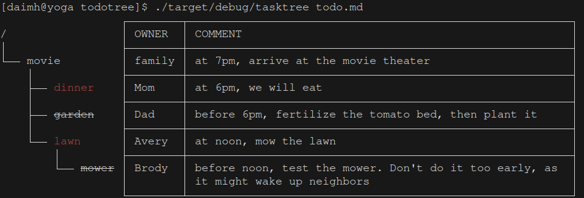

# Todo Tree

Display todos with a tree of dependencies. Highlight ongoing ones with color, or finished ones with strikethrough. Support terminal, html and json format.

Example: it prints the screen below with the todotree markdown file [todo.md](examples/todo.md)


## Installation

Clone the repo and go to the directory
```sh
cargo build --release
```

## Usage

```sh
cd examples
../target/release/todotree todo.md
../target/release/todotree todo.md lawn garden
../target/release/todotree -f term name-only.md
../target/release/todotree -f html no-comment.md > no-comment.html
../target/release/todotree -f json no-owner.md > no-owner.json
```

The input markdown file requires four special tags
1. "# ", the todo's name, mandatory. alphabet, digit and underline only. Strikethrough style means this todo is done
1. "- @ ", the todo's owner, optional
1. "- : ", the todo's dependency list, optional
1. "- % ", the todo's comment, optional


## License

the MIT License

## Contributing

feel free to send me a pull request
