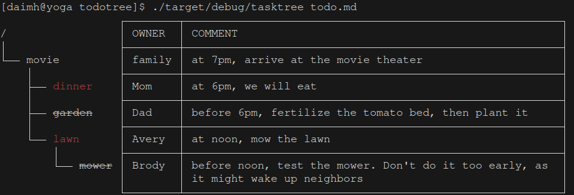

# Todo Tree

Display todos with a tree of dependencies. Highlight ongoing ones with color, or finished ones with strikethrough.

Example: it prints the screen below with the todotree markdown file [todo.md](todo.md)


## Installation

Clone the repo and go to the directory
```sh
cargo build --release
```

## Usage


```sh
./target/release/todotree todo.md
```

## License

the MIT License

## Contributing

feel free to send me a pull request
