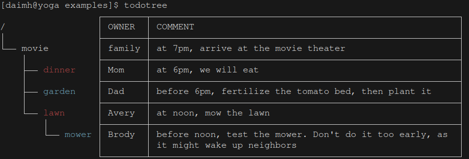

# Todo Tree

Display todos with a dependency tree. Highlight ongoing ones with red, or finished ones with strikethrough. Support terminal, html and json output format

## Example 
#### Input 
markdown file [todotree.md](examples/todotree.md) 

#### Output
- Terminal

- [html](https://htmlpreview.github.io/?https://raw.githubusercontent.com/daimh/todotree/refs/heads/master/examples/output/todotree.html)
- [json](examples/output/todotree.json)


## Installation

Clone the repo and go to the directory
```sh
cargo build --release
cp target/release/todotree ~/bin # or any directory in your PATH
```

## Usage
- show the todo tree in "examples/todotree.md"
```
cd examples
todotree 
```

- hide the todos that were already done
```
todotree -n
```

- show some specific todo
```
todotree lawn garden
```

- save the output as a file
```
todotree -o term -i name-only.md > name-only.term && cat name-only.term
```

- save the output to other format
```
todotree -o html -i no-comment.md > no-comment.html
todotree -o json -i no-owner.md > no-owner.json
```
- get help
```
todotree -h
```

- compile statically linked exectuable
```
RUSTFLAGS="-C target-feature=+crt-static" cargo build --release
```

Each todo in the input markdown file is defined by four special lines
1. "# " followed by the todo's name. Mandatory. The characters allowed are alphabets, digits, and some special charaters. To mark the job as done, enclose the name with '\~\~'. which applies a strikethrough style style to the input markdown file, the output html file and the terminal output.
1. "- @ ", followed by the todo's owner, optional
1. "- : ", followed by the todo's dependency list, which can be split to multiple lines for easier editing, optional
1. "- % ", followed by the todo's comment, optional

## My 2 Cents
This todo tree is a typical Graph structure, which is a little challenging for memory-safe Rust. I use Rc\<RefCell\<T>> to store the relation in the Graph, while avoiding either Unsafe or lifetime annotation. RefCell does have some runtime cost, However, I feel the debugging is easier than C/C++.

## License
The MIT License

## Contributing
Feel free to send me a pull request
